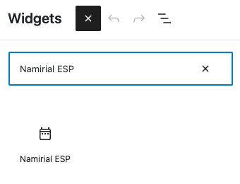

## Wordpress

The wordpress plugin can be installed with a manual installation.
You have to create a zip archive of the plugin/esp folder.
Next step you have to activate the plugin

### How to setup the plugin 

You have to set your ESP parameter on the plugin configuration section:

- host: the ESP domain uri
- environmentName: the ESP environment value
- final: The user session redirect uri (**Important! You have to contact the ESP team for a custom final uri** )
- apiKey: The api key useful for Backend Authentication
- attributes: The getKey *attributes* parameter
- level: The getKey *level* parameter
- spidType: The getKey *spidType* parameter

```text
ESP_HOST=INSERT HOST PARAMETER (WITHOUT THE TRAILING SLASH)
ESP_ENVIRONMENT_NAME=INSERT ENVIRONMENT NAME PARAMETER
ESP_FINAL=INSERT FINAL URI (REDIRECT URI)
ESP_API_KEY=INSERT APIKEY PARAMETER
ESP_ATTRIBUTES=Base
ESP_LEVEL=1
ESP_SPID_TYPE= INSERT SPID TYPE
```

You can run a local instance of wordpress with the following command:
```shell
docker compose up esp-wordpress
```
Now you can:
1. Go to http://localhost:8080;
2. Complete all the installation steps;
3. Install the esp plugin
4. Activate the plugin

5. Setup the plugin parameter
   
6. Include in your theme the widget called `ESP`
   
7. Setup widget options
   
8. Use the widget
   
